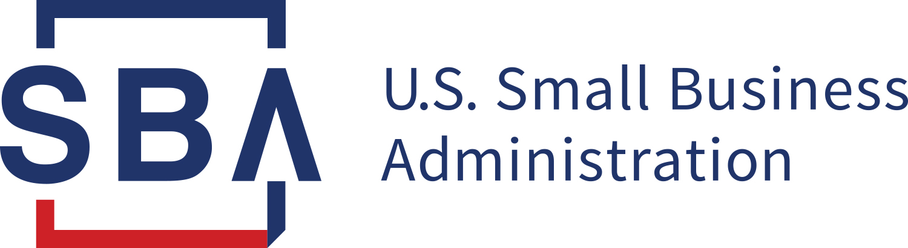

# Tableau Dashboard HW Assignment
    Using data from the Small Business Administration, develop a professional dashboard to show your findings on the 7a business loan program. Provide an an overview of how much money is distributed each year by the Small Business Administration, where the loans are used and which banks in each state are involved.

## Objectives
Review the distribution of Small Business Administration 7a Loans in the US. 

Questions to consider:

 - How much money does the SBA distribute each year?
 - Which industries recieve support and how much do they receive?
 - What are the associated demographics for SBA Loans in the US?
 - If a small Business wanted to apply for a loan, which Banks can they contact for support?

### Authors

* **James A. Smith**    [JAZ](https://github.com/jsmith6112)
